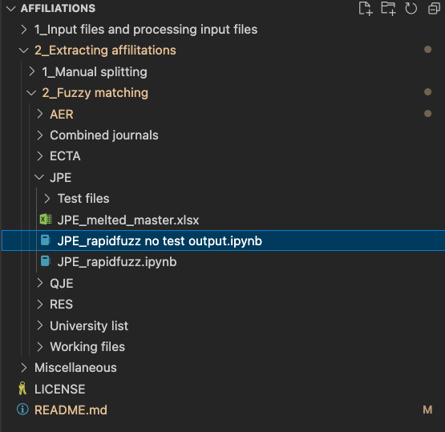

## Running the code 
The end code that is used is housed in 2__2 Fuzzy matching. In this folder there are subfolders for AER, JPE, QJE and RES run the files that end with 'no_test_output' to get to a final result. If you would like to output the testing files use the base Rapidfuzz files and edit the path to output to your own PC.

Below is the JPE code that should be run for that specific journal.

Once the 4 journals have been run, 'JPE_RES_QJE_AER_combined rapidfuzz no test output.ipynb' in 'Combined Journals' this will take the previous 4 outputs and combine them into 1 output.

## Simplified start to finish of project

### General data placement on page

In the 5 journals there are 3 general placements of the University name and author name. AER and QJE have this at the bottom of their last page. JPE and RES are on the first page. ECTA is either before references, appendix or in the footnotes. This is a general placement and it does change in each journal throughout the years, which adds to the complexity of the manual cleaning. There are also changes in line spacing and punctuation picked up by the PDF reader, with these combined it is near impossible to manually do this accurately.

The 3 images show this what this looks like in a PDF.

### Raw tesseract data
The data outputted is in this format with the affiliations line contaning the round about placement of the affiliation. It is generally within this text, although the output does contain additional text either above or below the string with the contained affilliation.

### Data processing
Next comes the extraction step detailed above in [2 Extacting affiliations](##2-Extracting-affilitions)

### Results
#### Cummulative plot of papers published over time for top 10 publishers in all journals
Output of '2_Extracting affilitations/2_Fuzzy matching/Combined journals/JPE_RES_QJE_AER_combined rapidfuzz.ipynb'

#### Ranking of Universities based on number of publications per decade

Output of '2_Extracting affilitations/2_Fuzzy matching/Combined journals/JPE_RES_QJE_AER_combined rapidfuzz.ipynb'
But this is taken a step further and plotted in Excel using pivot tables in Output of '/Users/MattJohnson/Desktop/Affiliations/2_Extracting affilitations/2_Fuzzy matching/Combined journals/Ranking.xlsx'

