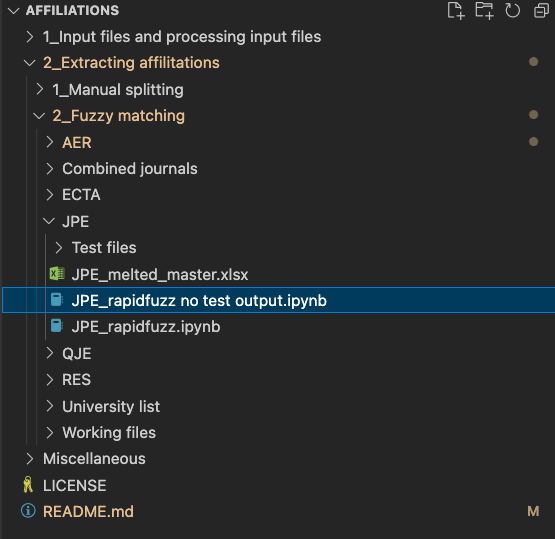
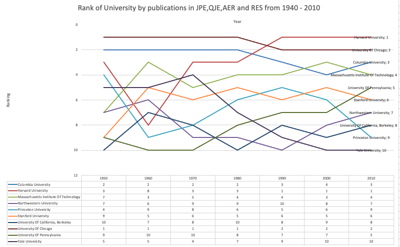

# Top 5 economic journal paper affiliation extraction
This repository details how University names are extracted from messy data for my masters dissertation which is to construct a long-term ranking of research intensity of universities globally based on publications in the Top 5 economics journals (AER, JPE, ECTA, QJE, REStud) from 1940 to 2020.

## Table of contents
* [General information](#General-information)
* [Setup](#Setup)
* [File strucuture and code locations](#File-strucuture-and-code-locations)
* [Intended use](#Intended-use)
* [Contact](#Contact)

## General information
The project provides details on how the extraction of messy data took place, the different project iterations as well as some of the analysis of the data. This project is intended for research purposes, anyone is free to use the IP and the output data.

## File strucuture and code locations
This repository has multiple individual pieces that contribute to a full picture in the end. This section details where all the pieces sit and what they are.

### 1 Input files and processing input files

#### 1_1 Input files
Contains the input data used in the extraction, this is raw data from tesseract (Tesseract affiliation  data), affiliation data obtained from scopus (Scopus files),   (master lists)

#### 1_2 Processing input files
Contains files used to clean master listsa and merge input data together as well as checking how many affiliations exist within scopus.

## 2 Extracting affilitions
Split into 2 sections of manual extraction and fuzzy matching. These are the 2 thoughts on how to extract affilitons from the different journals. 

### 2_1 Manual splitting
The first failed iteration of the project. This was an attempt at maually coding in rules to split the data. In the end this couldn't work due to the variability in the data. Especially when switching between journals.

### 2_2 Fuzzy matching
Within fuzzy matching there are the 5 journals each contains its own notebook for splitting as well as another folder which contains the combined splitting from multiple journals and output. University list contains the unique Universities that have been used in the fuzzy matcher which produce an output.

## Setup
The recommended software to run this program is Visual studio code. This project has been written to run on Mac and Windows and the file paths are linked to the Githib reposity, it will run once the requires libraries have been installed.

Libraries required:

use 'pip install' to install the libraries
json, pandas, rapidfuzz, matplotlib and requests

## Running the code 
The end code that is used is housed in 2__2 Fuzzy matching. In this folder there are subfolders for AER, JPE, QJE and RES run the files that end with 'no_test_output' to get to a final result. If you would like to output the testing files use the base Rapidfuzz files and edit the path to output to your own PC.

Below is the JPE code that should be run for that specific journal.

Once the 4 journals have been run, 'JPE_RES_QJE_AER_combined rapidfuzz no test output.ipynb' in 'Combined Journals' this will take the previous 4 outputs and combine them into 1 output.

## Simplified start to finish of project

### General data placement on page

In the 5 journals there are 3 general placements of the University name and author name. AER and QJE have this at the bottom of their last page. JPE and RES are on the first page. ECTA is either before references, appendix or in the footnotes. This is a general placement and it does change in each journal throughout the years, which adds to the complexity of the manual cleaning. There are also changes in line spacing and punctuation picked up by the PDF reader, with these combined it is near impossible to manually do this accurately.

The 3 images show this what this looks like in a PDF.

### Raw tesseract data
The data outputted is in this format with the affiliations line contaning the round about placement of the affiliation. It is generally within this text, although the output does contain additional text either above or below the string with the contained affilliation.

### Data processing
Next comes the extraction step detailed above in [2 Extacting affiliations](##2-Extracting-affilitions)

### Results
#### Cummulative plot of papers published over time for top 10 publishers in all journals
Output of '2_Extracting affilitations/2_Fuzzy matching/Combined journals/JPE_RES_QJE_AER_combined rapidfuzz.ipynb'

#### Ranking of Universities based on number of publications per decade

Output of '2_Extracting affilitations/2_Fuzzy matching/Combined journals/JPE_RES_QJE_AER_combined rapidfuzz.ipynb'
But this is taken a step further and plotted in Excel using pivot tables in Output of '/Users/MattJohnson/Desktop/Affiliations/2_Extracting affilitations/2_Fuzzy matching/Combined journals/Ranking.xlsx'

## Intended use
This project is intended for academic work and is free to use for anyone.
6543
## Contact 
Created by @Matt970204 as part of my MPhil in FinTech at the University of Cape Town.

## Addito
